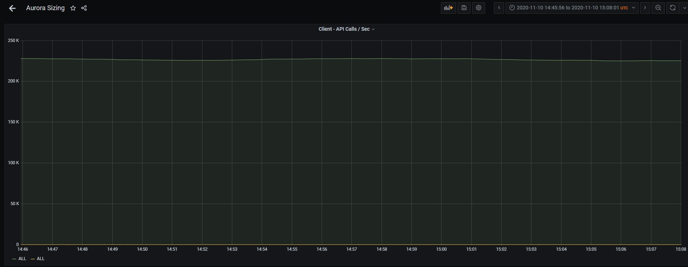
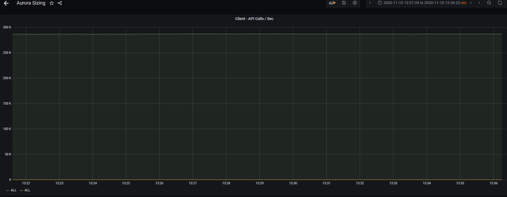
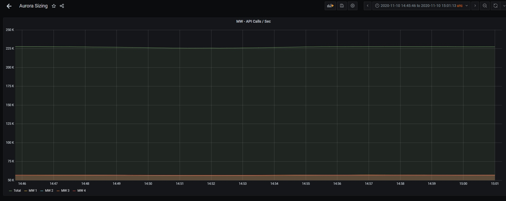
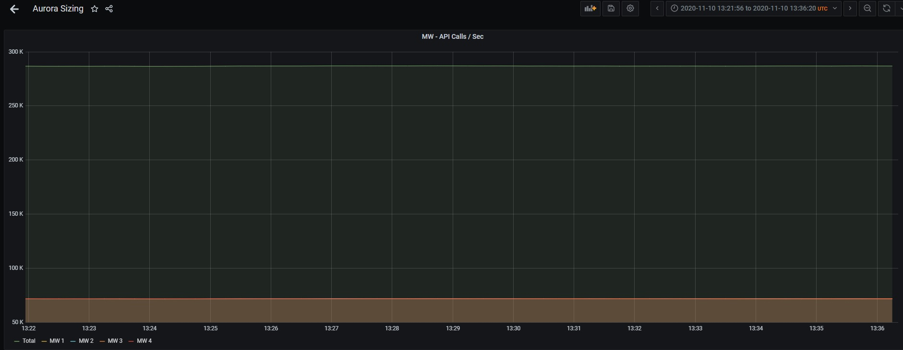
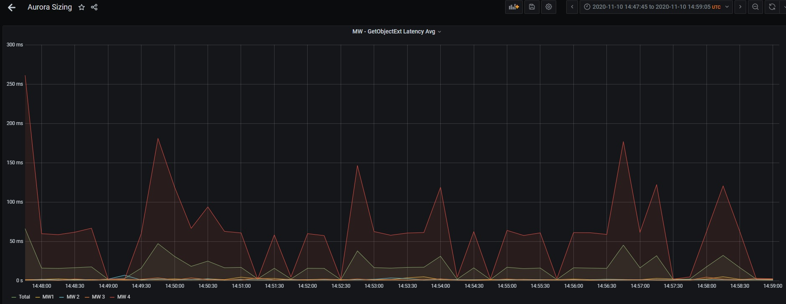
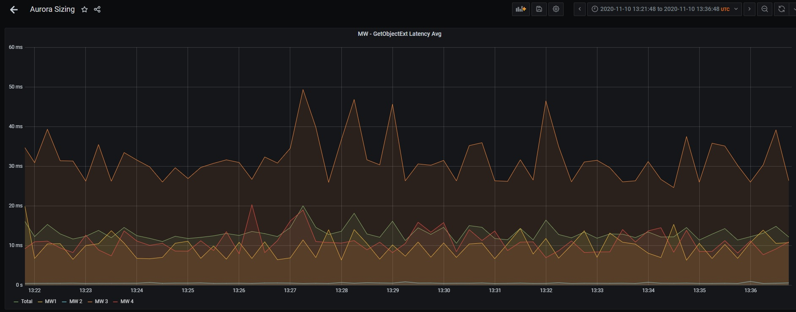
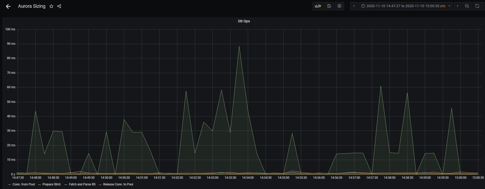
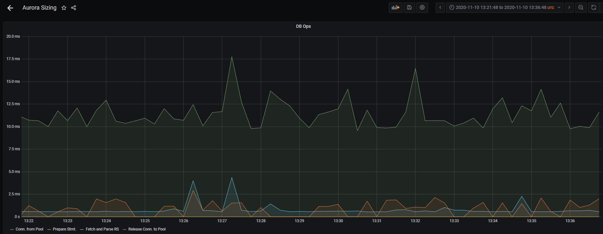

| Middleware | Specs |
| ----------- | ----------- |
| | 4 MW ( Server ) Instances [ c5.9xlarge = 36 vCPUs + 72GiB ] - GRPC Server |
| | 12 Gb Max Heap + 12 Gb Max Direct Memory |

| Client | Specs |
| ----------- | ----------- |
| |4K Instances of GRPC Clients|

| Aurora | Specs |
| ----------- | ----------- |
| | 1 Writer + 1 Reader [ db.r5.8xlarge = 32 vCPUs + 256 GB ] |
| | Basic Authorization |
| | Data Content - 3K * 560 Bytes Records |

| Test Case 1 |
| ----------- |
|1 Lookup for fetching all the Object Keys|
| Fetch single record ( GetObject ) in loop all 3K Keys serially + repeat |
| All calls directed to the Single Read Replica Instance |
| Connection Pool Impl = HikariCP | 

| Test Case 2 |
| ----------- |
|1 Lookup for fetching all the Object Keys|
| Fetch single record ( GetObject ) in loop all 3K Keys serially + repeat |
| All calls directed to the Single Read Replica Instance |
| Connection Pool Impl = TomcatJDBC  | 

#### Compare 

|   | Hikari DB | TomcatJDBC |
| ----------- | ----------- | ----------- |
| Client Throughput |  |  |
|| ||
| Middleware Throughput ||  |
||||
| GetObject Latency on Middleware |  |  |
||||
| DB Operation on Middleware ||  |

