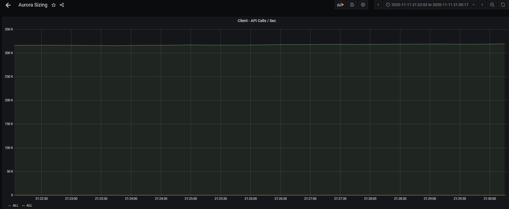
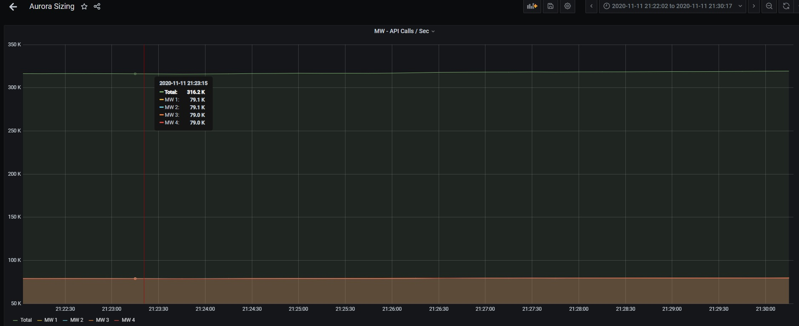
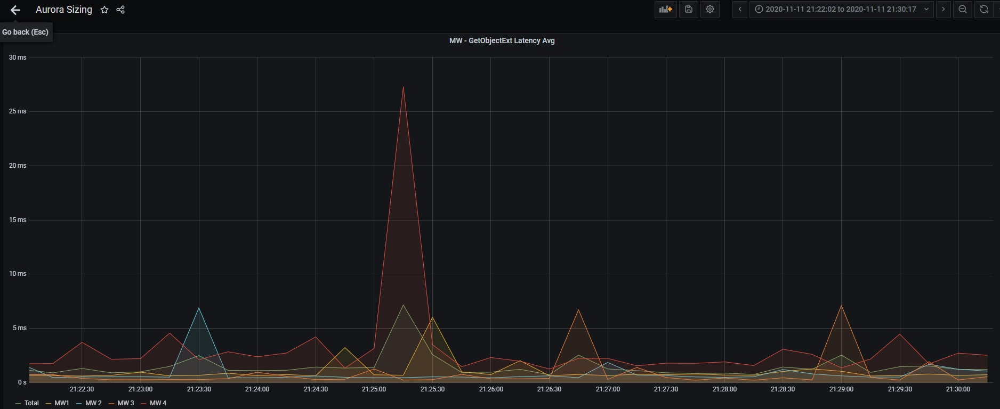
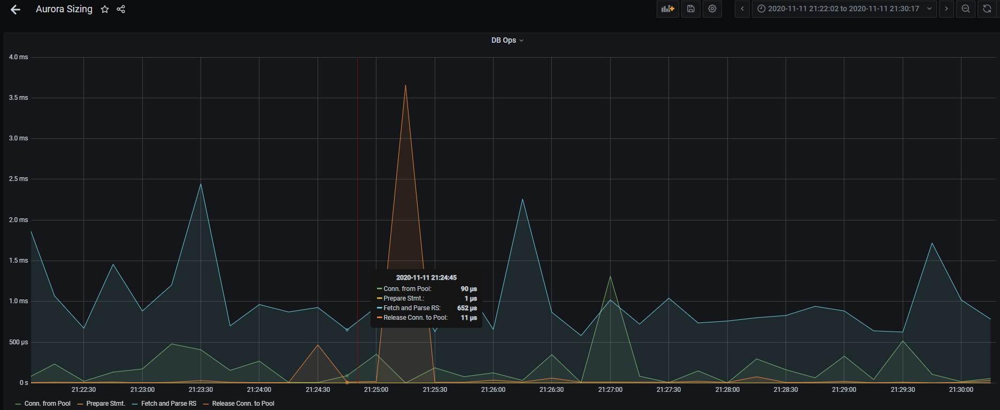

| Middleware | Specs |
| ----------- | ----------- |
| | 4 MW ( Server ) Instances [ c5.9xlarge = 36 vCPUs + 72GiB ] - GRPC Server |
| | 12 Gb Max Heap + 12 Gb Max Direct Memory |

| Client | Specs |
| ----------- | ----------- |
| |4K Instances of GRPC Clients|

| Aurora | Specs |
| ----------- | ----------- |
| | 1 Writer + 1 Reader [ db.r5.8xlarge = 32 vCPUs + 256 GB ] |
| | Basic Authorization |
| | Data Content - 3K * 560 Bytes Records |

| Test Case 1 |
| ----------- |
|1 Lookup for fetching all the Object Keys|
| Fetch single record ( GetObject ) in loop all 3K Keys serially + repeat |
| All calls directed to the Single Read Replica Instance |
| Connection Pool Impl = HikariCP | 
| 2 Connection Pools = 1 Pointing to RO DNS + 1 Pointing to RW DNS |
| dataSourceClassName=org.postgresql.ds.PGSimpleDataSource |
| RO Pool maximumPoolSize = 150 | 
| RO Pool minimumIdle = 50 | 
| RW Pool maximumPoolSize = 1 | 
| RW Pool minimumIdle = 1 |
| registerMbeans = true | 
| transactionIsolation = TRANSACTION_READ_COMMITTED | 
| idleTimeout = 1800000 | 
| maxLifetime = 1800000 |
| dataSource.user = postgres | 
| dataSource.password = xxxxx | 
| dataSource.databaseName = poosgres | 
| dataSource.portNumber = 5432 | 
| dataSource.serverName = xxxxxx | 
| dataSource.currentSchema = default |
| dataSource.prepareThreshold = 1 | 
| autoCommit = false | 

| Test Case 2 |
| ----------- |
|1 Lookup for fetching all the Object Keys|
| Fetch single record ( GetObject ) in loop all 3K Keys serially + repeat |
| All calls directed to the Single Read Replica Instance |
| Connection Pool Impl = TomcatJDBC  | 
| 2 Connection Pools = 1 Pointing to RO DNS + 1 Pointing to RW DNS |
| url = jdbc:postgresql://<>:<>/<>?currentSchem=default |
| driverClassName = org.postgresql.Driver | 
| username = postgres |
| password = xxxx |
| jmxEnabled = false |
| setTestWhileIdle = false |
| setTestOnBorrow = false |
| setValidationQuery = "SELECT 1" // This is not used though, since validation is disabled |
| setTestOnReturn = false |
| setValidationInterval = 30000  // Not used | 
| setTimeBetweenEvictionRunsMillis = 30000 | 
| setMaxActive = 150 for RO and 1 for RW |
| setInitialSize = 10 | 
| setMaxWait = 20000 | 
| setRemoveAbandonedTimeout = 60 |
| setMinEvictableIdleTimeMillis = 30000 | 
| setMinIdle = 10 |
| setLogAbandoned = true | 
| setRemoveAbandoned = true | 
| setDefaultAutoCommit = false |
| setDefaultTransactionIsolation = Connection.TRANSACTION_READ_COMMITTED | 
| setJdbcInterceptors = "org.apache.tomcat.jdbc.pool.interceptor.StatementFinalizer" |

| Test Case 3 |
| ----------- |
|1 Lookup for fetching all the Object Keys|
| Fetch single record ( GetObject ) in loop all 3K Keys serially + repeat |
| All calls directed to the Single Read Replica Instance |
| Connection Pool Impl = SimplePool  | 

#### Compare 

|   | Hikari DB | TomcatJDBC |
| ----------- | ----------- | ----------- |
| Client Throughput |  |  |
|| ||
| Middleware Throughput ||  |
||||
| GetObject Latency on Middleware |  |  |
||||
| DB Operation on Middleware ||  |

|   | Simple Pool |
| ----------- | ----------- | 
| Client Throughput |  |
|||
| Middleware Throughput ||
|||
| GetObject Latency on Middleware |  |
|||
| DB Operation on Middleware ||

