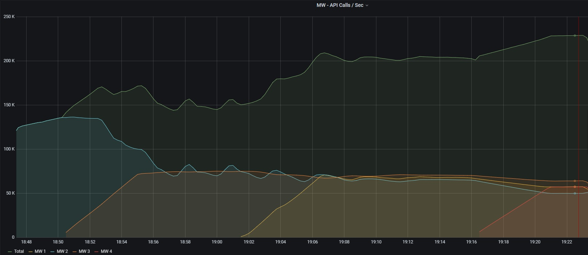
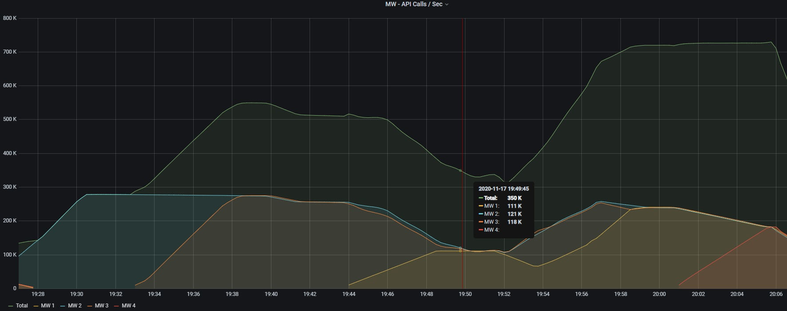
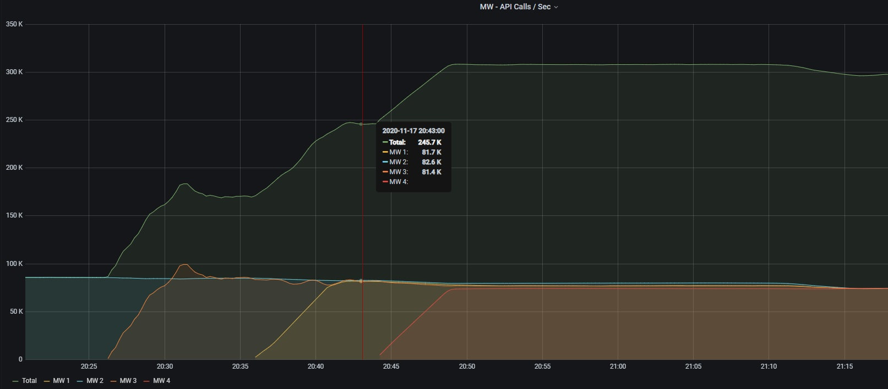

###### Reader Compute Class = db.r5.8xlarge
###### Connection Pool Size ( per MW Instance )= 150
###### Connection Pool Impl = HikariCP
###### Clients = 4K
###### Scenario = Gradually Increase the MW Instance keeping rest of the Factors Same 

---

######## Test 1

A single instance can reach 130 K/s
When we add a second instance the throughput of both dips down to 77 K/s
After starting 2 more MW instances, the throughput on each stays at 50 - 60 K/s
The resultant throughput goes upto 228 K/s

Inference = Given that individually the MW instance perform better, there is a throttling in play.
So we remove the DB interactions, emulate DB fetch by generating 560 Bytes of payload from MW itself

---

######## Test 2

Stubbed MW, individually can achieve 278 K/s
On subsequent addition of MW instances, the throughput settles around 726 K/s
The value does not change by adding more MW instances. 

Inference = 726 K/s is the limit of the Clients, with the same client infra, we cannot achieve 
additional throughput by bumping up MW
So, to test if Arora can perform better, we bumped up the Compute class of the Reader instance to 
db.r5.24xlarge

---

######## Test 3

###### Reader Compute Class = db.r5.24xlarge
Rest remains the same

Surprisingly a single instance can reach 86 K/s with *24xlarge Compute class, compared to 130 K/s for single MW instance when 
used with *8xlarge reader

Gradually adding more instance does not cause a dip as seen in Test 1, the throuphut adds up.
Saturates at around 300 K/s

---

